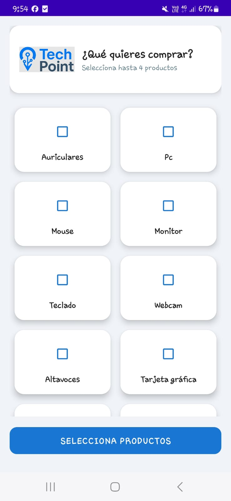
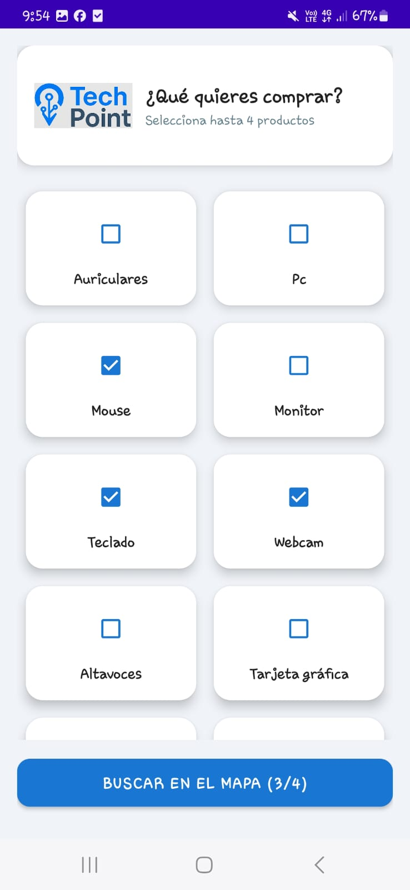
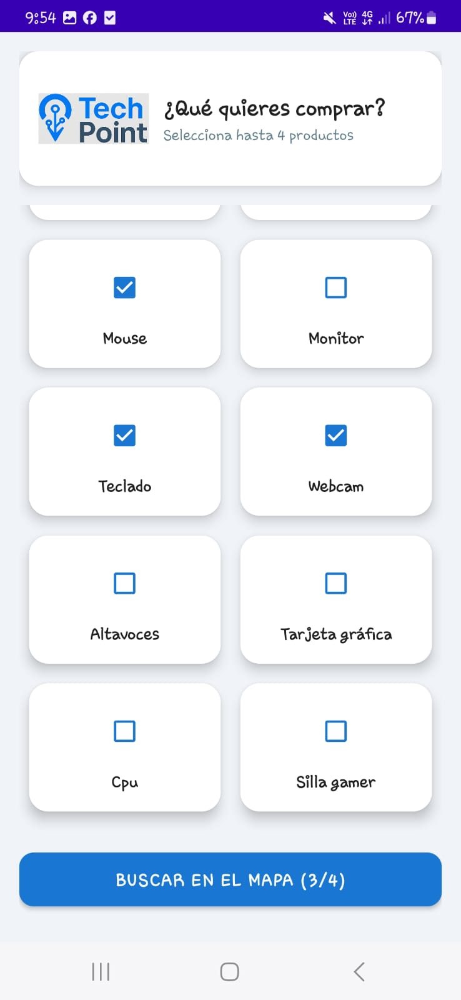
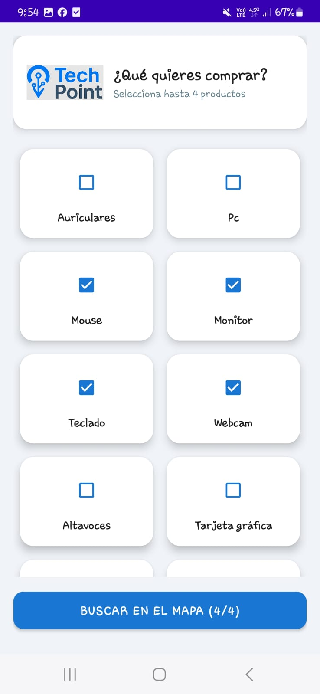
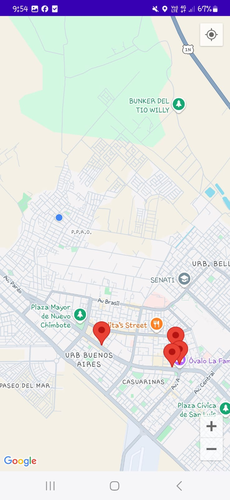
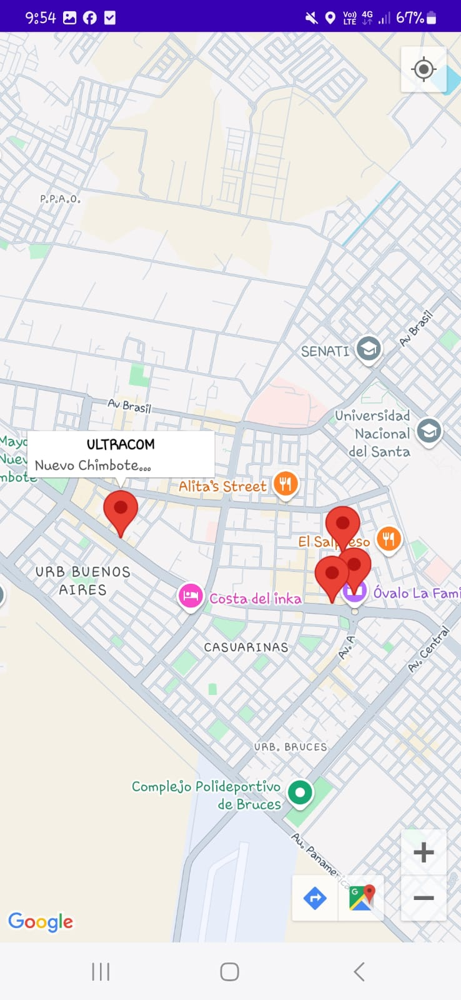
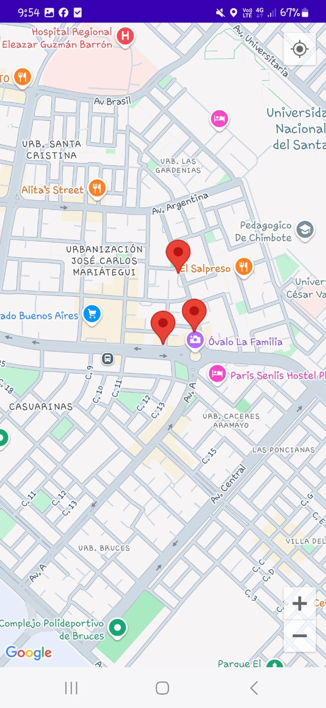
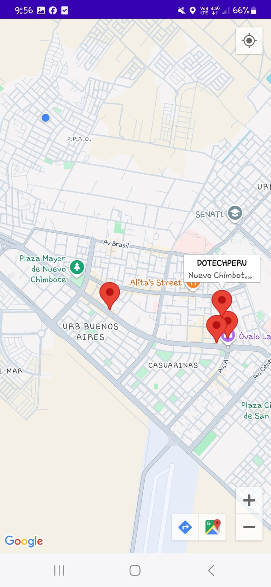
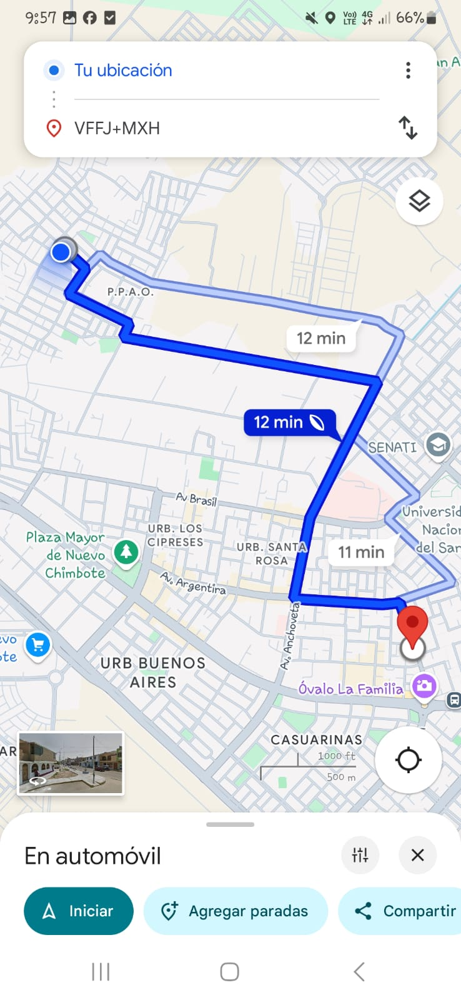

# 🗺️ **TechPoint - Mapa de Establecimientos de Equipos de Cómputo en Chimbote**

**Desarrollado por:** Valentino Guevara  
**Correo:** [202114033@uns.edu.pe](mailto:202114033@uns.edu.pe)  
**GitHub:** [ValentinoGuevara](https://github.com/ValentinoGuevara)  
**Curso:** Aplicaciones Móviles - Semana 13  

<div align="center">
  
</div>

## 🛠️ **Tecnologías Utilizadas**

<div align="center">
  <a href="https://developer.android.com/topic/libraries/architecture/viewmodel">
    
  </a>
  <a href="https://developer.android.com/topic/libraries/architecture/livedata">
    
  </a>
  <a href="https://kotlinlang.org/">
    
  </a>
  <a href="https://material.io/components">
    
  </a>
  <a href="https://developers.google.com/maps/documentation/android-sdk">
    
  </a>
</div>

## 🔍 **¿Cómo funciona la aplicación?**

**TechPoint** es una aplicación que permite a los usuarios localizar establecimientos en **Chimbote** que venden equipos de cómputo. Utiliza el **Google Maps API** para mostrar el mapa, detectar la ubicación del usuario y recomendar los establecimientos más cercanos donde se pueden comprar productos como PC, teclados, monitores, entre otros.

---

### 🏗️ **Arquitectura y Flujo**

1. **Detección de Ubicación del Usuario**:
   - La aplicación usa la ubicación actual del usuario para recomendar los establecimientos más cercanos.
   - Implementa **Google Maps API** para mostrar los puntos de interés.

2. **Recomendación de Establecimientos**:
   - Los usuarios pueden ver los establecimientos cercanos a ellos en el mapa, marcados con un ícono.
   - La aplicación muestra el tiempo estimado para llegar a cada establecimiento.

3. **Interfaz Moderna**:
   - Diseño visual inspirado en **Material Design**.
   - Botones grandes, claros y responsivos.
   - Compatible con modo oscuro.

---

### 🌟 **Características Destacadas**

| Característica | Descripción |
|----------------|-------------|
| 🗺️ **Mapa interactivo** | Visualización de establecimientos de cómputo en el mapa de Chimbote |
| 📍 **Detección de ubicación** | Ubicación del usuario detectada automáticamente |
| ⏱ **Tiempo de llegada** | Recomendación del tiempo estimado para llegar a cada establecimiento |
| 🖥️ **Equipos de cómputo disponibles** | Muestra información de los productos disponibles en cada tienda |
| 🌙 **Modo oscuro** | Compatible con el modo oscuro para una visualización cómoda |

---

### 📱 **Capturas de Pantalla**

<div align="center">
  <table>
    <tr>
      <td></td>
      <td></td>
      <td></td>
    </tr>
    <tr>
      <td></td>
      <td></td>
      <td></td>
    </tr>
    <tr>
      <td></td>
      <td></td>
      <td></td>
    </tr>
    <tr>
      <td></td>
    </tr>
  </table>
  <p>Explora el mapa, selecciona productos y encuentra los mejores establecimientos cercanos.</p>
</div>

---

## 🛠️ **Implementación Técnica**

### 🧩 **Uso de Google Maps API**

```kotlin
val gmap: GoogleMap = googleMap
val userLocation = LatLng(currentLocation.latitude, currentLocation.longitude)
gmap.addMarker(MarkerOptions().position(userLocation).title("Tu ubicación"))
```

### 🧱 **Dependencias y Herramientas**

| Herramienta | Uso |
|-------------|-----|
| **Google Maps API** | Muestra el mapa interactivo y los puntos de interés |
| **Kotlin** | Lógica de la aplicación |
| **Material Design Components** | UI moderna |
| **ViewModel** | Persistencia de datos |
| **LiveData** | Observación reactiva |

---

## 🚀 **¿Cómo Ejecutarla?**

1. Clona el repositorio:  
   ```bash
   git clone https://github.com/ValentinoGuevara/TechPoint.git
   ```

2. Abre en **Android Studio** y espera que sincronice Gradle.

3. Ejecuta la aplicación en tu emulador o dispositivo físico.

---

## 🧩 **Posibles Mejoras Futuras**

- 🗺 **Ampliar el área de cobertura** para otras ciudades.
- 🖥️ **Integrar catálogo de productos** por cada tienda.
- 🔄 **Actualizar ubicación en tiempo real** al moverse el usuario.
- 🎯 **Filtros de búsqueda** (por tipo de producto o tienda).

---

## 📚 **Contexto Académico**

Este proyecto fue desarrollado como parte del curso de **Aplicaciones Móviles**, con el objetivo de aplicar el uso de **Google Maps API** y arquitectura **MVVM** en una aplicación Android.

---

## 📜 **Licencia**

**© 2025 - Valentino Guevara**  
Prohibido el uso comercial sin autorización expresa.

<div align="center">
  
  <p>¡Explora el código y contribuye!</p>
  <a href="[https://github.com/ValentinoGuevara/TechPoint](https://github.com/ValentinoGuevara/S13_AM.git)">
    
  </a>
</div>

---
